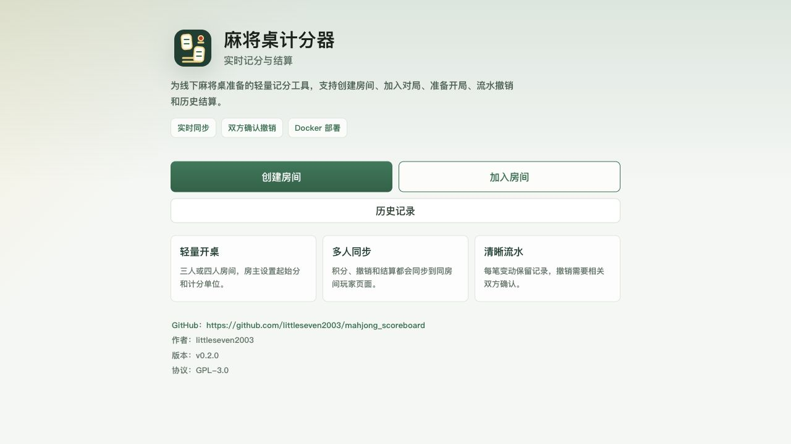
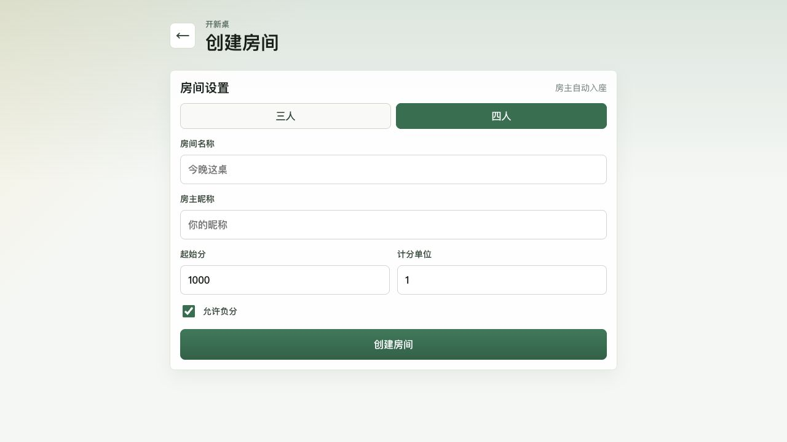
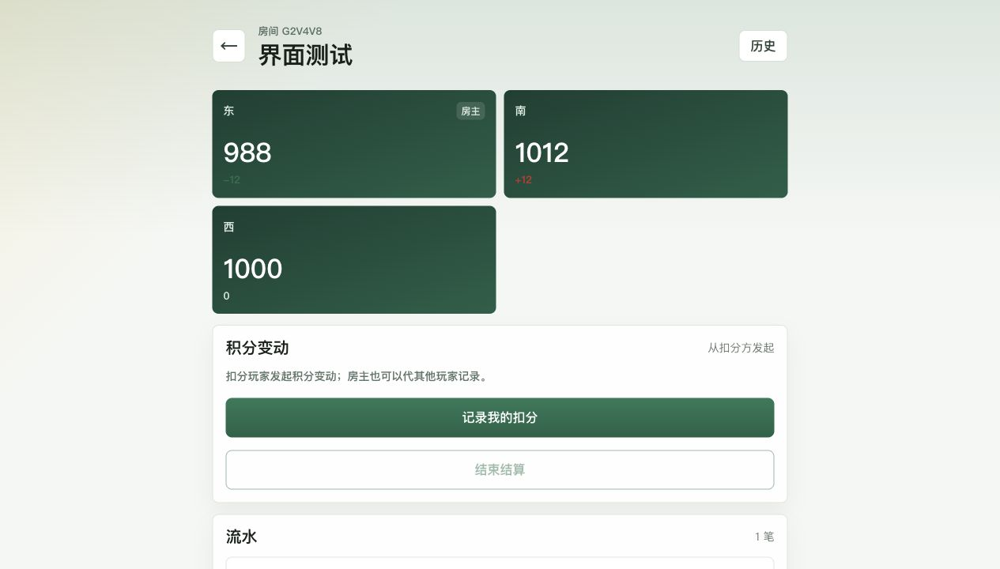
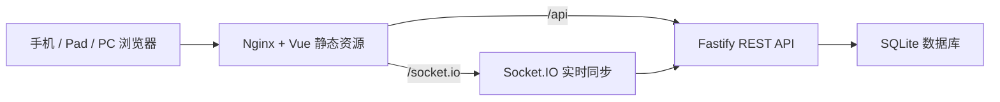

<div align="center">


# 雀桌记

轻量、实时、适合线下麻将桌的 Web 记分与结算工具。

[](https://github.com/littleseven2003/mahjong_scoreboard/releases)
[](LICENSE)
[](docs/deployment.md)
[](https://vuejs.org/)
[](https://nodejs.org/)

[快速部署](#快速开始) · [功能特性](#项目特性) · [界面预览](#界面预览) · [文档](#文档)

</div>

## 项目简介

`雀桌记` 是一个面向家庭娱乐麻将桌场景的轻量级实时计分与结算 Web 应用。项目仓库名为 `mahjong_scoreboard`，支持 Docker Compose 部署，用户在局域网内通过手机浏览器访问同一个房间，实时查看分数、流水和结算结果。

后端是唯一可信分数来源。前端只提交操作，所有分数变化、撤销和结算都由后端写入 SQLite 后广播给客户端。

## 界面预览

| 首页 | 创建房间 |
| --- | --- |
|  |  |

| 房间记分 |
| --- |
|  |

## 项目特性

| 能力 | 说明 |
| --- | --- |
| 快速开桌 | 创建三人或四人房间，设置起始分、计分单位和负分规则 |
| 实时同步 | 积分变动、撤销流水、准备状态和结算结果同步到房间内所有页面 |
| 扫码加入 | 房主在等待页展示二维码，玩家扫码后自动填入房间号 |
| 积分变动 | 扣分玩家发起记录；房主可代其他玩家记录扣分 |
| 双方撤销 | 指定流水需要相关双方确认后才会回滚分数 |
| 继续对局 | 首页可重新进入当前浏览器加入过的未完成对局 |
| 历史结算 | 房主结束对局后生成结算，并保留历史详情 |
| 管理实验 | 通过环境变量启用管理员入口，查看数据并清理已结束对局 |

## 功能范围

- 创建三人或四人房间
- 从首页继续进入未完成对局，超时对局可删除本机入口
- 玩家通过房间号、二维码链接或页面扫码加入
- 设置起始分、计分单位、是否允许负分
- 非房主准备 / 取消准备 / 退出等待房间
- 房主在房间人数满员且所有非房主准备后开始对局，或在准备阶段解散房间
- 通过弹窗记录扣分玩家、加分玩家、分数和备注
- Socket.IO 实时同步房间状态
- 查看记分流水
- 相关双方确认后撤销指定流水
- 房主结束对局并生成结算
- 查看历史对局和历史详情
- 实验性管理员入口、数据查看、单条删除和已结束对局定时清理

当前不包含完整麻将规则、自动算番、普通用户登录、微信分享、公网访问、排行榜或金额支付能力。本项目只用于娱乐积分记录与结算辅助。

## 快速开始

### 部署用户

推荐从 GitHub Release 下载稳定版本：

1. 打开 [Releases](https://github.com/littleseven2003/mahjong_scoreboard/releases) 页面。
2. 下载目标版本的 `Source code (zip)` 或 `Source code (tar.gz)`。
3. 解压后进入项目根目录。
4. 执行 Docker Compose 部署命令：

```bash
docker compose up -d --build
```

部署后访问：

```text
http://服务器局域网IP:8899
```

当前分支版本：`v1.3.0-admin-alpha.1`。该版本包含管理员与数据管理实验功能，和正式稳定版区分发布。

如需启用管理入口，请在后端环境变量中配置管理员密码：

```bash
ADMIN_PASSWORD=请替换为高强度密码
ADMIN_SESSION_SECRET=请替换为随机长字符串
```

未配置 `ADMIN_PASSWORD` 时，首页“管理”入口会无法完成验证。

### 开发者

安装依赖：

```bash
npm install
```

启动后端：

```bash
npm run dev:server
```

启动前端：

```bash
npm run dev:web
```

浏览器访问：

```text
http://localhost:8899
```

生产构建：

```bash
npm run build
```

## 技术架构



## 技术栈

| 模块 | 技术 |
| --- | --- |
| 前端 | Vue 3, Vite, TypeScript, Pinia, Vue Router |
| 后端 | Node.js 24, Fastify, Socket.IO |
| 数据库 | SQLite |
| 部署 | Docker Compose, Nginx |

## 项目结构

```text
mahjong_scoreboard/
├── docs/
│   ├── api.md
│   ├── deployment.md
│   ├── design.md
│   ├── development.md
│   └── usage.md
├── server/
│   ├── src/
│   ├── data/
│   └── Dockerfile
├── web/
│   ├── src/
│   ├── nginx/
│   └── Dockerfile
├── docker-compose.yml
├── LICENSE
├── package.json
└── README.md
```

## 文档

| 文档 | 说明 |
| --- | --- |
| [设计文档](docs/design.md) | 项目定位、页面结构、业务规则 |
| [使用说明](docs/usage.md) | 创建房间、加入房间、记分、撤销和结算 |
| [部署说明](docs/deployment.md) | Docker Compose 部署和数据持久化 |
| [开发说明](docs/development.md) | 本地开发、构建验证和目录说明 |
| [API 概览](docs/api.md) | REST API 与 Socket.IO 事件 |

## 合规声明

本软件工具仅用于线下娱乐麻将场景中的积分记录与结算辅助，与任何赌博、资金交易或其他违法行为无关。使用者应遵守所在地法律法规，不得将本项目用于任何违法违规用途。

## 开源协议

本项目使用 [GNU General Public License v3.0](LICENSE) 开源。

## 提交规范

提交消息使用中文 Conventional Commit 格式：

```text
feat: 实现房间创建功能
fix: 修复撤销流水后分数错误
docs: 完善部署说明
chore: 更新项目配置
```
